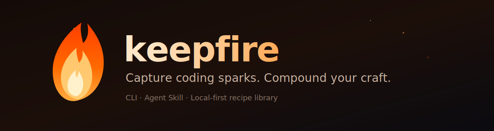

<p align="center">
  
</p>

<p align="center">
  <strong>留住那条真正好用的 prompt，下次相似任务直接复用——改写适配，而不是原样粘贴。</strong>
</p>

<p align="center">
  <a href="../README.md">English README</a>
  ·
  <a href="https://github.com/ljf06853/keepfire">GitHub</a>
  ·
  <a href="../SKILL.md">SKILL.md</a>
</p>

---

## Keepfire 是什么？

当一条编程 prompt 终于"打准了"——审查一针见血、修复恰到好处——那个措辞往往就死在聊天记录里了。Keepfire 把它存成结构化的**配方**（模板 + 约束 + 好在哪），下次遇到相似任务时找出来，**按新场景改写**，而不是把旧文本原样贴回去。

所有数据都是本地 Markdown 文件，存在 `~/.keepfire/`。不用注册，不上云。既是 **CLI**，也是 Claude Code / Codex / Gemini CLI 等工具的 **Agent Skill**。

```text
你：   这条 PR 审查 prompt 太好用了，收藏
       🔥 Kept #2026-07-09-pr-security-review-a1b2

─── 下周 ───

你：   keepfire use "用安全审查方式看这个 webhook PR"
       → 输出你验证过的审查配方，已适配到 webhook 任务
```

---

## 安装（5 分钟）

### Claude Code——两条命令，无需构建

```text
/plugin marketplace add ljf06853/keepfire
/plugin install keepfire@keepfire
```

装完即用。你会得到四个自动触发的 skill——**capturing-sparks**（收藏好 prompt）、**recalling-recipes**（相似任务时复用）、**harvesting-sparks**（挖掘忘了收藏的）、**tending-the-garden**（管理配方库）——以及 prompt 日志 hook。可以直接跳到[「直接和 Agent 说」](#最简单的用法直接和-agent-说)。

对 Claude Code 来说下面的 CLI 是可选的（skill 没有 CLI 时会直接读写 `~/.keepfire` 文件），但推荐装——搜索和保存会更快更一致。

### CLI + 其他 AI 工具（Codex、Gemini CLI 等）

需要 **Node.js 18+** 和 **git**。npm 包尚未发布，先从源码安装。

**第 1 步——下载代码并构建：**

```bash
git clone https://github.com/ljf06853/keepfire.git
cd keepfire
npm install
npm run build
npm link          # 让 keepfire 命令全局可用
```

**第 2 步——创建配方库，接入你的 AI 工具：**

```bash
keepfire init --link codex,gemini,agents,cursor
```

这一步会创建 `~/.keepfire/`，并把单文件 skill 装进你列出的每个工具。多列了也无害。（Claude Code 用户请用上面的插件方式，**不要**再 `--link claude`——两边都装会导致 skill 重复触发。）

**第 3 步——验证：**

```bash
keepfire version   # → 0.1.1
keepfire path      # → 配方库所在位置
```

> **Windows 用户：** 在 Git Bash 或 PowerShell 里执行上述命令。如果系统禁止符号链接，第 2 步会静默改为**复制** skill——因此每次更新（`git pull && npm run build`）后，重新跑一遍第 2 步刷新。

> **macOS / Linux 快捷方式：** `curl -fsSL https://raw.githubusercontent.com/ljf06853/keepfire/main/install.sh | bash` 会替你完成第 1–2 步。

> **国产工具**（通义灵码、Comate、CodeGeeX 等）若尚无统一 skills 目录：直接用 CLI，把 `use` 输出的适配 prompt 粘进对话即可。

---

## 第一次使用（2 分钟）

**1. 导入示例配方**（在 `keepfire` 目录里执行）：

```bash
keepfire import examples/sample-recipes.json
keepfire list
```

**2. 用一个真实任务召回：**

```bash
keepfire use "用安全审查方式看这个 webhook PR"
```

会列出带编号的候选。选一个应用：

```bash
keepfire use --pick 1 "用安全审查方式看这个 webhook PR"
```

输出就是一条可直接使用的 prompt——粘进你的 AI 工具即可。（如果最佳匹配足够强，`use` 会跳过询问直接应用。）

**3. 收藏你自己的第一条配方：**

```bash
keepfire keep --title "最小修复调试循环" \
  --intent debug \
  --prompt "先复现，再定位，再做最小修复。不要顺手重构。" \
  --triggers "最小修复|minimal fix|debug loop" \
  --yes
```

看到 `🔥 Kept #...` 就成功了。长 prompt 用 `--prompt-file ./spark.txt` 或 stdin 管道传入。`keepfire help` 可查看全部参数。

---

## 最简单的用法：直接和 Agent 说

第 2 步装好 skill 之后，你根本不需要敲命令。在 Claude Code / Codex 里直接说：

| 你说 | 会发生什么 |
|------|-----------|
| 「收藏这个问法」/ `/keep` | Agent 从对话里抽取配方并保存（先问你确认） |
| 「用我以前审 PR 的方式看这个」/ `/use` | Agent 召回配方、适配到当前任务、然后执行 |
| 「列出我的配方」/ `/garden` | 浏览、搜索、删除、升级 |
| 「挖掘我最近的 prompt」/ `/harvest` | 从 prompt 日志里找回忘了收藏的火花 |

Agent 也会**主动提议**收藏它发现的好 prompt（`🔥 这条要 keep 吗？`），但**入库永远需要你点头**。不想要提议就 `keepfire mode suggest off`。

---

## 日常循环（3 个习惯）

1. **某条 prompt 打得特别准？** 说「收藏这个」——或者接受 Agent 的 🔥 提议。
2. **又遇到相似任务？** 说「用我以前那种方式」——配方会改写适配到新任务，绝不盲目粘贴。
3. **每周一次：** 跑 `keepfire harvest`，找回忘了收藏的好 prompt（需要先开启下面的日志）。

---

## 可选：自动记录 prompt 日志

让 Agent 把每条 prompt 自动记在本地，之后用 `harvest` 挖掘。

> **Claude Code 插件用户：这一步已自动生效**——插件自带该 hook，跳过本节即可。

仅使用 CLI 的场景：

**第 1 步：** 记下你克隆 keepfire 的路径（例如 `D:/tools/keepfire`）。

**第 2 步：** 在 `~/.claude/settings.json`（Claude Code）里加：

```json
{
  "hooks": {
    "UserPromptSubmit": [
      { "hooks": [ { "type": "command", "command": "node /path/to/keepfire/dist/cli.js journal --from-hook", "timeout": 10 } ] }
    ]
  }
}
```

**第 3 步：** 从你的下一条消息起，prompt 会记入 `~/.keepfire/journal.jsonl`（斜杠命令和过短消息自动跳过；数据不出你的机器）。然后：

```bash
keepfire harvest            # 候选标为 NEW 或 covered-by:<id>（已有类似配方）
keepfire journal --list     # 查看原始日志
```

harvest 是**筛选，不是批量导入**——只保留沉淀了可复用过程的那几条。

---

## 命令速查

| 命令 | 作用 |
|------|------|
| `keepfire keep --title T --prompt P --yes` | 收藏配方（长 prompt 用 `--prompt-file F` 或 stdin） |
| `keepfire use "任务"` | 列出匹配配方；强匹配会自动应用 |
| `keepfire use --pick N "任务"` | 应用列表里第 N 个候选 |
| `keepfire use --id <片段> "任务"` | 按 id 应用——任何唯一片段即可（如 `--id 4zri`） |
| `keepfire search "关键词"` | 只搜索不应用 |
| `keepfire list` / `show <id>` / `delete <id> --yes` | 管理配方库 |
| `keepfire improve <id> --note "..."` | 保存改进版（v2、v3…） |
| `keepfire journal --list` / `keepfire harvest` | prompt 日志 / 挖掘日志 |
| `keepfire mode` | 查看或修改模式（见下） |
| `keepfire export [file]` / `import <file>` | JSON 备份 / 恢复 |
| `keepfire stats` / `path` / `reindex` | 信息与维护 |

---

## 模式

```bash
keepfire mode capture confirm     # 收藏：先确认（默认）——或 auto
keepfire mode use ask_if_low_confidence   # 或 always_ask | auto
keepfire mode suggest on          # Agent 主动提议收藏（默认开）——或 off
keepfire mode threshold 0.75      # 自动应用的最低置信度（0~1）
```

| 模式 | 行为 |
|------|------|
| `capture confirm` | Agent 侧先展示草稿再保存；CLI 侧加 `--yes` 保存 |
| `capture auto` | 你说「收藏」后立即保存 |
| `use ask_if_low_confidence` | 只有强匹配才自动应用，否则先问你 |
| `use always_ask` / `use auto` | 永远先问 / 永远直接用最佳匹配 |
| `suggest on` | Agent 可以**提议**收藏火花；入库仍需你点头 |

---

## 你的数据

```text
~/.keepfire/
  config.json          # 模式与阈值
  index.json           # 快速索引（可重建）
  journal.jsonl        # 本地 prompt 日志（供 harvest）
  cards/
    2026-07-09-....md  # 一条配方一个文件——纯 Markdown，适合 git
```

- 用 `export KEEPFIRE_HOME=/path/to/library` 可改存放位置。
- 一切都在你的机器上。用 git 或 `keepfire export` 备份。
- **不要**把 token、密钥、凭证写进 prompt——skill 会指示 Agent 脱敏，但责任在你。

---

## 常见问题（排错）

**`keepfire: command not found`** —— 回到 keepfire 目录重新 `npm link`，然后重启终端。或直接调用：`node dist/cli.js help`。

**Agent 对「收藏这个问法」没反应** —— 检查 skill 是否装上：`ls ~/.claude/skills/keepfire`（或对应工具的 skills 目录）。缺失就重跑 `keepfire init --link claude`，并新开一个 Agent 会话。

**更新了 keepfire 但 Agent 还是旧行为（Windows）** —— 符号链接被禁止时 skill 是复制安装的。`git pull && npm run build` 之后重跑 `keepfire init --link ...`。

**召回不到我的配方** —— 收藏时补全 `--triggers` / `--tags` / `--stack`；或直接 `keepfire use --id <片段>` 指定。

**团队能共享配方库吗？** —— 目前以个人库为主。可以把 `~/.keepfire` 放进 git 仓库，或用 `keepfire export` 分发。

---

## 开发

```bash
npm run build     # 编译到 dist/
npm test          # node:test 测试套件
npm run dev -- <args>   # 从源码运行 CLI
```

仓库结构：`src/`（TypeScript CLI）· `skills/` + `.claude-plugin/` + `hooks/`（Claude Code 插件）· `SKILL.md`（其他 Agent 用的单文件 skill）· `templates/card.md`（配方模板）· `examples/`（示例配方）。

## 路线图

- [ ] 发布 npm 包
- [ ] 更强的语义检索（可选本地 embedding）
- [ ] 可发布的配方包（个人 / 团队）
- [ ] 非 CLI 场景的浏览器伴侣

欢迎 Issue / PR：https://github.com/ljf06853/keepfire/issues

## 许可证

[MIT](../LICENSE) © 2026 ljf06853

---

<p align="center">
  <sub>如果 Keepfire 帮你留住过一次「神 prompt」，请点一个 ⭐ —— 火花需要氧气。</sub>
</p>

<p align="center">
  <a href="../README.md">English README</a>
</p>
